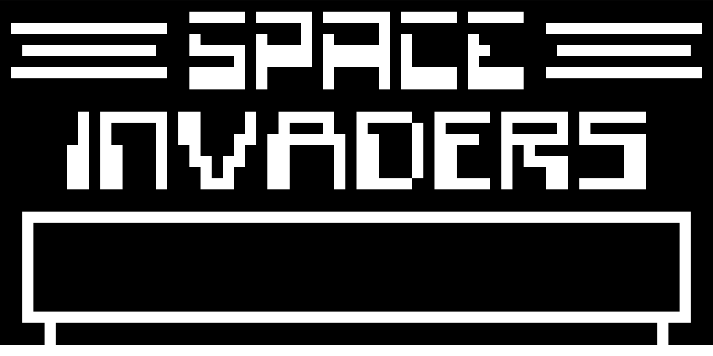
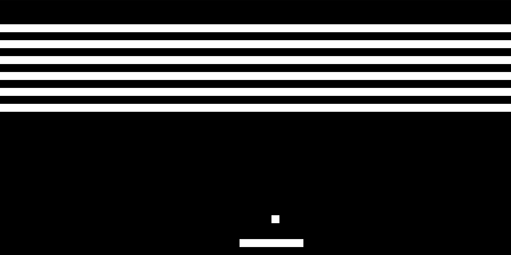
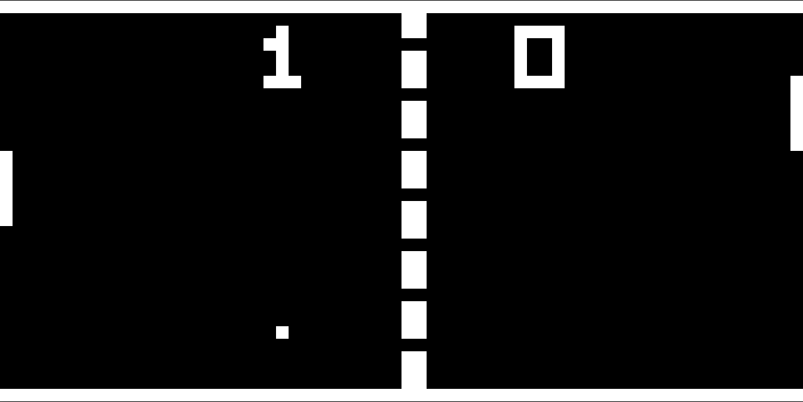

# rchip8

A CHIP-8 emulator written in Rust.

## Usage
This crate depends on the [rust-sdl2](https://github.com/Rust-SDL2/rust-sdl2) library. Please refer to their readme to find instructions on how to install SDL for each platform.

Once the SDL dependency is satisfied, the emulator can be launched with:

```
cargo run path/to/rom
```

There are some additional options to set the emulation frequency and pixel size:

```
Usage: rchip8 [OPTIONS] <ROM>

Arguments:
  <ROM>  ROM to execute

Options:
  -f, --freq <FREQ>    emulated CPU frequency [default: 500]
  -p, --pixel <PIXEL>  size of pixels [default: 10]
  -h, --help           Print help
  -V, --version        Print version
```

The CHIP-8 keypad is binded to the following keys:

```
|1|2|3|C| -> |1|2|3|4|
|4|5|6|D| -> |Q|W|E|R|
|7|8|9|E| -> |A|S|D|F|
|A|0|B|F| -> |Z|X|C|V|
```

## Screenshots

### Space Invaders


### Breakout


### Lunar Lander


### Pong
